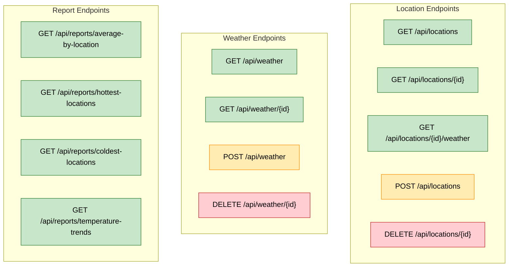

# Weather API Endpoints

## API Endpoints Overview

## Detailed Endpoint Descriptions

### Location Endpoints

| Method | Endpoint | Description |
|--------|----------|-------------|
| GET    | `/api/locations` | Retrieve all location records |
| GET    | `/api/locations/{id}` | Get a specific location by ID |
| GET    | `/api/locations/{id}/weather` | Get all weather data for a specific location |
| POST   | `/api/locations` | Create a new location (with duplicate checking) |
| DELETE | `/api/locations/{id}` | Delete a location (with optional cascade parameter) |

### Weather Endpoints

| Method | Endpoint | Description |
|--------|----------|-------------|
| GET    | `/api/weather` | Retrieve all weather data with location details |
| GET    | `/api/weather/{id}` | Get a specific weather record by ID |
| POST   | `/api/weather` | Create a new weather record (with optional new location) |
| DELETE | `/api/weather/{id}` | Delete a specific weather record |

### Report Endpoints

| Method | Endpoint | Description |
|--------|----------|-------------|
| GET    | `/api/reports/average-by-location` | Get average temperatures by location |
| GET    | `/api/reports/hottest-locations` | Get top 10 hottest locations |
| GET    | `/api/reports/coldest-locations` | Get top 10 coldest locations |
| GET    | `/api/reports/temperature-trends` | Get temperature trends over the last 7 days |

## HTTP Methods Legend

- 🟢 **GET** - Retrieve data
- 🟠 **POST** - Create new records
- 🔴 **DELETE** - Remove records