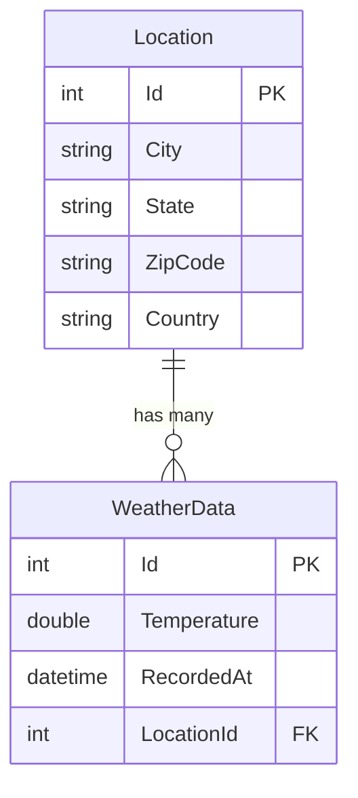

# WeatherAPI Data Model

## Entity Relationship Description

- A **Location** entity represents a geographic location defined by city, state, zip code, and country.
- Each **Location** can have multiple **WeatherData** entries associated with it.
- A **WeatherData** entity represents a temperature reading at a specific point in time.
- Each **WeatherData** entry belongs to exactly one **Location**.

## Database Schema

### Location Table
- `Id` (Primary Key, Auto-increment)
- `City` (String, Not Null)
- `State` (String, Not Null)
- `ZipCode` (String, Not Null)
- `Country` (String, Not Null)

### WeatherData Table
- `Id` (Primary Key, Auto-increment)
- `Temperature` (Double, Not Null)
- `RecordedAt` (DateTime, Not Null)
- `LocationId` (Foreign Key referencing Location.Id, Not Null)

## Relationship
- One-to-Many relationship between Location and WeatherData
- A Location can have many WeatherData records
- Each WeatherData record belongs to exactly one Location